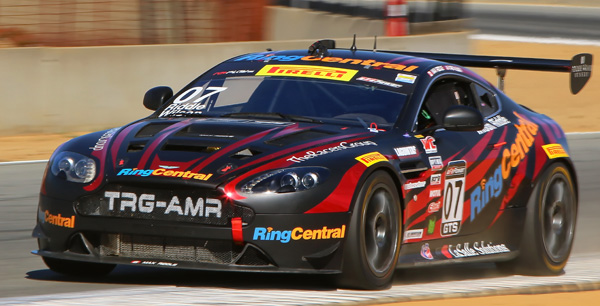
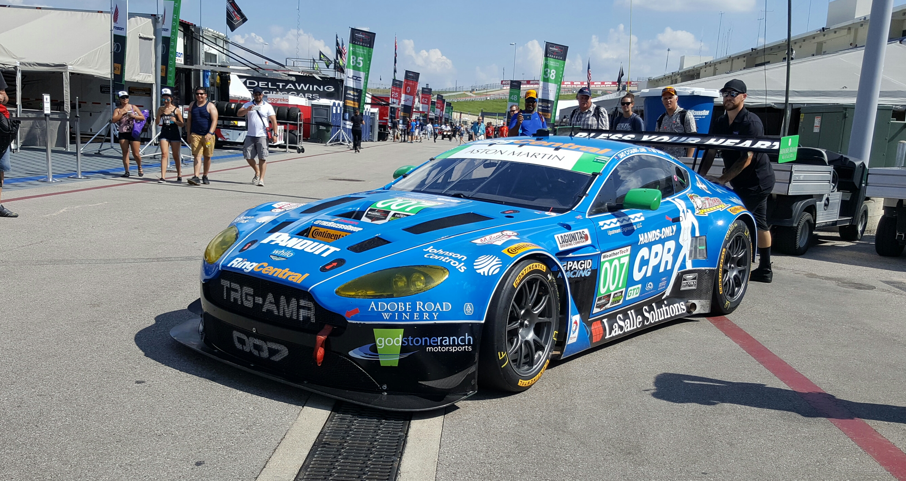
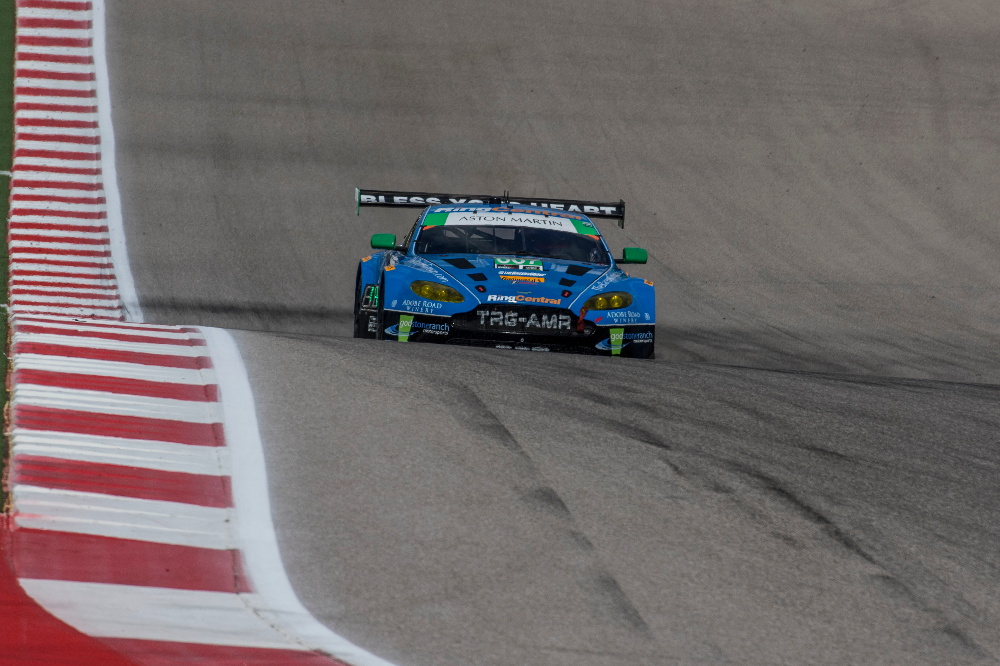
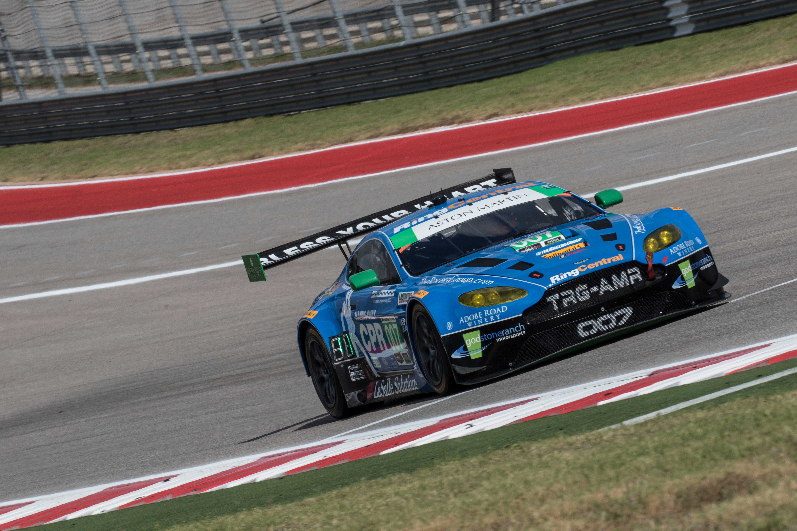
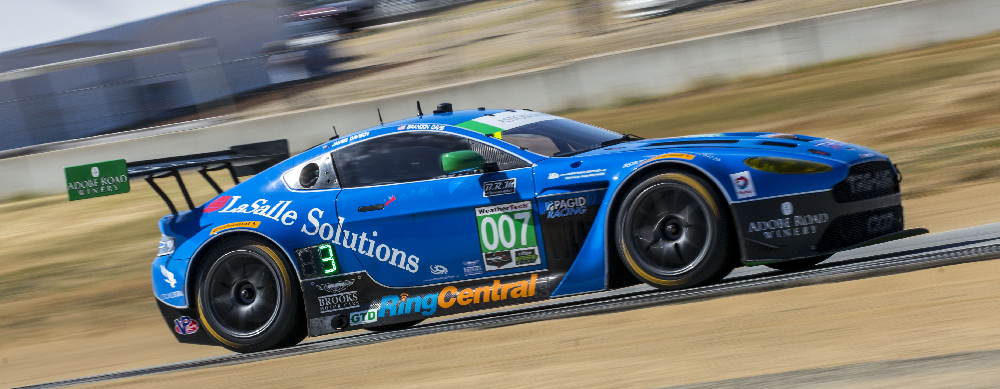

# RingCentral Racing

## 2014 ASTON MARTIN V8 VANTAGE GT4

$165,000  NOW $115,000

The Aston Martin Vantage GT4 is the most popular GT4 car in the world. Nearly 100 cars have been made and are competing in race series across the globe.

Like the VANTAGE GT3 and VANTAGE GTE, the carís foundation is the acclaimed Vantage road car and it carries over the same chassis, V8 powertrain and drive train, including the semi automatic sports shift system. The springs and dampers are upgraded to racing specification with stiffened front and rear anti-roll bars and the option for rose-jointed wishbones.

* 6-speed h-pattern
* Jet-hot ceramic coated straight pipe exhaust
* 4-way adjustable ohlin’s dampers
* Bosch fully adjustable race ABS
* Fully adjustable race traction control
* Hot climate package/light-weight front end
* Split master cylinders w/ booster delete
* Adjustable brake bias control
* Brembo endurance front and rear brake calipers and rotors
* Push button drink bottle system
* Motorola pm400 with ptt and imsa 4ch helmet plug
* Left and right driver helmet nets
* Racekeeper PWC package with 2 cameras, GPS, and OBD-II connector
* Light-weight, heated, lexan front windscreen, with tabs
* Front camber plate lock-out system
* K&N cold air intake/filters
* Over $1500 in gold heat wrapping in various locations
* New fuel cell, pumps, and filter
* Carbon fiber replacement headlight covers(when headlights are not required)
* Carbon fiber rear 1/4 window NACA ducts
* Carbon fiber gt3 type hood(PWC spec)
* Quick release trunk for refueling
* Custom aluminum rear under-tray
* Various spares package with wheels
* Motec c125 logger with i/o options, pro logging, l10 basic 10hz gps and the following sensors:
* Brake pressures
* Fuel pressure
* Oil pressure
* Oil temp
* Engine temp
* RPM
* Steering
* G lat
* G long
* Fuel usage
* G-sport rear wing
* Cool Suit system
* Helmet blower
* Driver window net
* GT3 turnbuckle tie-rods
* Driver leg brace
* Power mirrors
* a/n flex tranny lines

## 2013 ASTON MARTIN V12 VANTAGE GT3

$325,000

The Vantage GT3 has been designed from the ground up to offer customers the latest in race-car technology and embraces all the experience Aston Martin Racing has learnt from years of engineering and competing in international sports car racing with the DBR9, DBRS9 and the latest VANTAGE GTE. Designed to be the current Aston Martin GT3 car for the next five years, the Vantage GT3 is developed so there are no expensive yearly upgrades with the power of the V12 engine being unlocked when required through Balance of Performance.

* 720Hp V12 Engine, to be refreshed before delivery
* Pneumatic Paddle-Shift, X-Trac 600 Series Gearbox
* FIA/IMSA-Spec Roll Cage
* All IMSA/WC Required Safety Nets
* Endurance Braking Package, Upgraded Front 6-Pot Brembo Calipers, Ducting, Steel Racing
* Rotors, Pagid Pads
* PI Cosworth Full Color Dash, Custom AMR Software
* Bilstein Fully Adjustable Shocks, Rebuilt With Custom Valving
* 3 Sets Wheels, One Piece, Lightweight, TWS
* Upgraded Adjustable Front Sway Bar
* Custom Pwr Radiator
* Upgraded Endurance Front Grille Package
* Racekeeper Video And Data System
* Coolsuit System
* Radio
* All Carbon Bodywork

